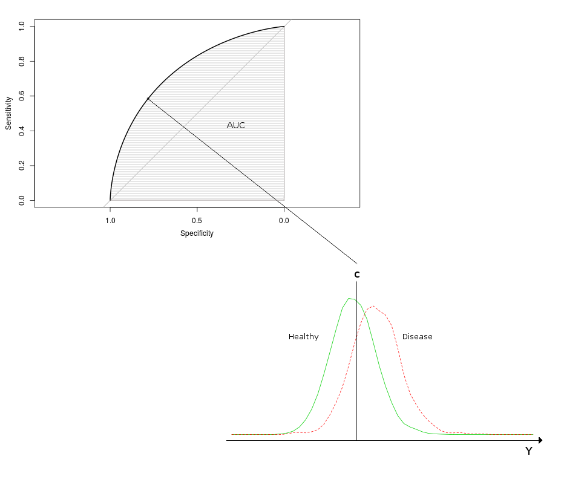
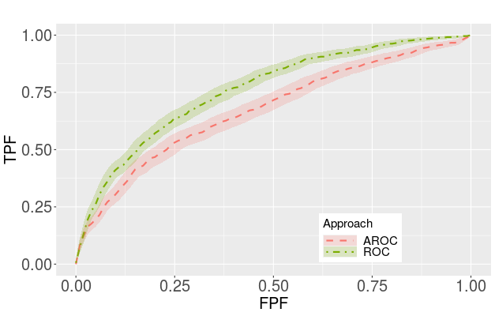
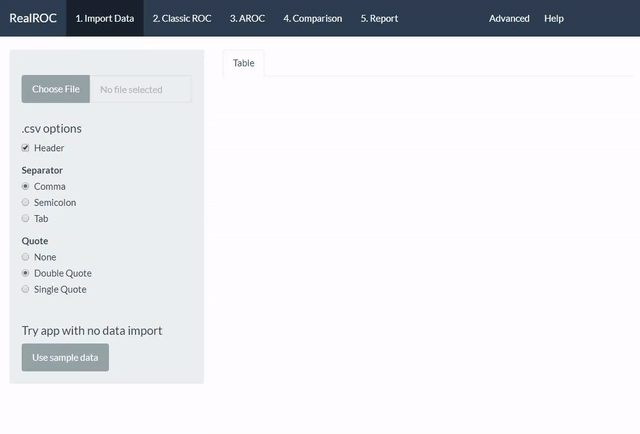
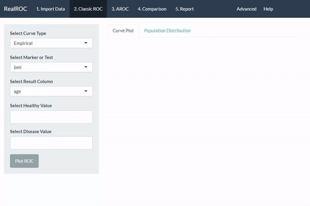
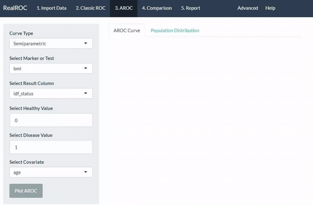

# RealROC

---

Welcome to **RealROC**! This app helps you generate adjusted ROC curves using several modern methods of estimation and covariate accomodation as well as established methods of performing a classic ROC analysis for your data.

This section is designed to help new users navigate the app and aid them in performing the best analysis for their purposes.

### "What do I need to start?"
Nothing! This application needs no prior material to use, a working understating of ROC and AROC curves can be helpful but you can just start and then check back to this section and understand what you did.

What are ROC curves?

ROC curves are a statistical tool to help perceive if a given marker/ system of classification is appropriate to distinguish between two groups, for instance healthy and diseased individuals from a population .

The result is a plot where the area under the curve (AUC) can indicate the accuracy of the prediction, the higher the area the more acurate the prediction   

  

What about AROC curves?

Many times, particularly in complex systems of classification, unintended variables may be counfounding the results of the ROC curves. A simple example of this is age counfounding a diagnostic due to an increased immune response in younger individuals compared to older one's, while this specific factor is usually incorporated into the markers the principle holds. 

Removing these biases from classification systems is important be it to improve the classifier or to provide a more accurate view of the test, as such the adjusted ROC curve - AROC, was developed to incorporate possible variable dependecies into the analysis.

  

### RealROC step by step

---

#### 1. Home Screen and import data

You can upload your own data or press the action button to use the sample data provided by the app, either option will trigger a data-table to appear where you can explore your data, this is a great way to see if the import was sucessfull and if your data is properly parsed.  

After you've explored your data we can move on to the analysis proper!

#### 2. Classic ROC analysis

This first module is where you can perform the standard (or classic) ROC analysis, you can skip this step or comeback later if you wish.
First you need to select the inputs for the analysis, these are present on the left sidebar and include the marker, your result tab, and the values indicating Healthy and Disease Value on said tab. At the top you will also find multiple options for the type of ROC curve you wish to compute, you can explore these options to see which one suits your work best.

Press the action button and you will see the application will begin it's calculations and present you with a ROC curve and a density plot for your population to better describe your data.

At any time you can ckeck the report tab on top to see your results and any addicional information for your ROC and AROC curves.

#### 3. AROC construction
This section is where you can perform AROC analysis,it is similar in structure to the previous module however a new option is present at the bottom of the sidebar panel to select the covariate to study its effects on the ROC curve. If you're following along you may have noticed your previous choices are recorded and kept from section to section.

Select the covariate you wish to introduce and press the action button, like previously the app will compute the AROC curve and population densities with the covariate in mind, depending on the nature of this covariate the density tab may present you with a dotplot or a boxplot for continuous and binary covariates respectively.

#### 4. Comparing adjusted and unadjusted ROC curves
This section is used to directly compare ROC and AROC curves. Two methods are available, the AROC and Comp2ROC methods. The AROC method simply superimposes both ROC and AROC curves produced on the previous sections to better visualize the differences between the two. The second method allows one to compare **binary** covariates using the Braga method, this splits the marker by binary value and conducts a covariate-specific ROC curve analysis allowing the user to see how values of the covariate change the behaviour of the ROC curve

#### 5. Report Section and miscellaneous options 
The report section logs all actions taken in the application and is the closest option to an R console output however the outputs for each action are parsed to present the most straightforward and clear information possible. This section can be accessed at any time by the user to get extra information on the generated ROC curves, such as AUC and CI values, in the case of covariate adjustment and the comparison module this is displayed with extra information on the fitted regression model and Z-statistic value and p-value, that will help the user determine not just through visual output if the covariate has add a confounding effect on their data.

If by chance the user must change the data imported to the tab they can do so with the Advanced section. These modifications can be inverting the signal of a giver variable, such as markers that do not follow the standard ROC assumption of higher values of the marker being representative of the case/disease population, a simple logarithmic transformation or even fixing common mistakes of the data such as a binary variable being recorded as a numeric value that can have implications on output.

---

For more information you can access the code over at [github](https://github.com/frmachadoecosta/RealROC) or contact the developer directly at realrocdev@gmail.com
